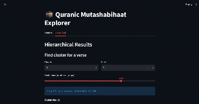
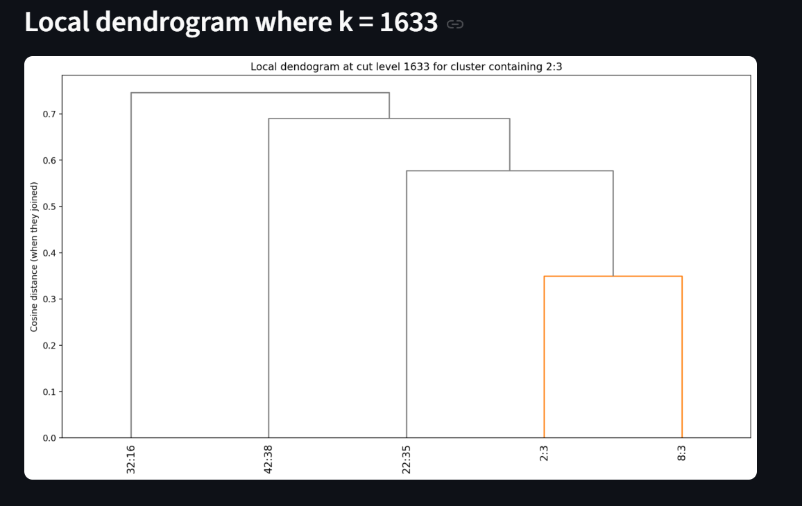
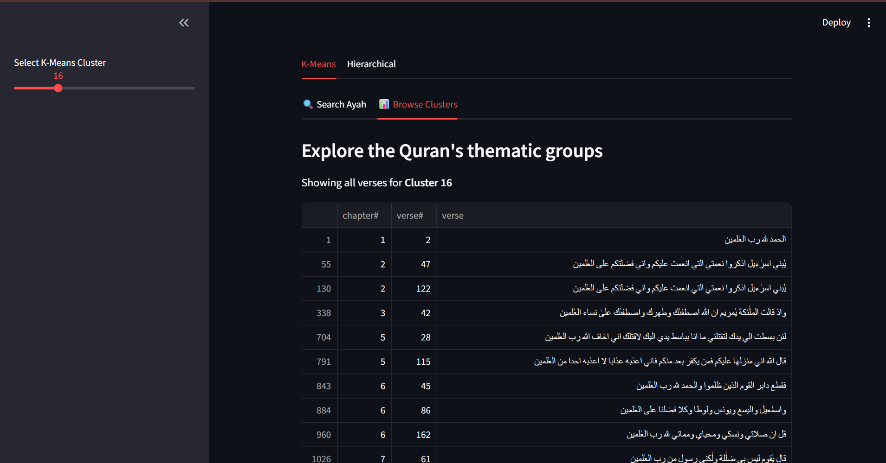

# Quran Verse Similarity Search (Mutashabihat finder)
A python project which uses machine learning clustering algorithms to find *mutashabihat*—verses in the Qur'an that are similar in wording.

> Status: **In progress** — ML algorithms tested; Streamlit web app developed (not deployed yet).

## Motivation
There are many study resources which provide “lists of similar verses”, but those lists can be **limited in coverage** (they don't exhaustively list all verses that are similar) and **hard to explore interactively**, making them less effective for learners.

This project explores whether unsupervised ML algorithms can be leveraged to:
- find the same verse-to-verse similarities that are already in existing lists,
- find **additional** verse-to-verse similarities beyond existing lists,
- provide **fast interactive search** (type/select a verse → get the most similar verses),


Even if you’re not familiar with the Qur’an, you can think of this as a sort of **document similarity** problem on a large corpus of text.

## Features

- Uses 2 clustering algorithms:
  - **K-Means**
  - **Aggolomerative clustering**
- Clusters all verses into groups where verses have similar wording
- (In progress) Produces diagrams/analysis to inspect clusters and compare the effectiveness of the 2 algorithms against each other and  existing lists 
- (In progress) Deploys a Streamlit web app for user interaction- allows users to select a verse and see all similar verses in the Qur'an, or to select a cluster and see all verses in the cluster

## Visuals
### Demo



| Screenshots  |  |  
| :--- | :--- |              
|  |  | 

## Tech stack

**Python**: pandas, numpy, matplotlib, scikit-learn  
**App (WIP)**: Streamlit

---


## Installation

### 1. Prerequisites

- Python 3.10+
- pip (usually installed with Python)
- Git (optional, for cloning)

### 2. Clone and enter the project

```bash
git clone https://github.com/Zain1958/similarity-search.git
cd similarity-search
```

### 3. Create and activate a virtual environment

```bash
python -m venv venv

# Windows (PowerShell)
venv\Scripts\Activate.ps1

# Windows (Git Bash / CMD alternative)
source venv/Scripts/activate

# macOS/Linux
source venv/bin/activate
```

### 4. Install dependencies

```bash
python -m pip install --upgrade pip
python -m pip install pandas numpy matplotlib scikit-learn scipy streamlit jupyter notebook

python -m pip install rapidfuzz # Optional, for running notebooks/01_initial_tests.ipynb if desired
```

### 5. Verify installation (optional)

```bash
python -c "import pandas, numpy, matplotlib, sklearn, scipy, streamlit; print('Setup OK')"
```

### 6. Run the app

```bash
streamlit run app.py
```

### 7. Open notebooks (optional)

```bash
# If you see: "No module named notebook"
python -m pip install notebook

# Open the notebook UI in the notebooks folder
cd notebooks
python -m notebook

# Open one notebook directly (if you are inside notebooks/)
# Replace 03_hierarchical_clustering.ipynb with other notebook filenames as desired
python -m notebook 03_hierarchical_clustering.ipynb

# Or open one notebook directly from project root
python -m notebook notebooks/03_hierarchical_clustering.ipynb
```

---


## License
This project is licensed under the MIT License.

See [LICENSE](LICENSE) for the full text.

---

## Contact
GitHub: https://github.com/Zain1958
